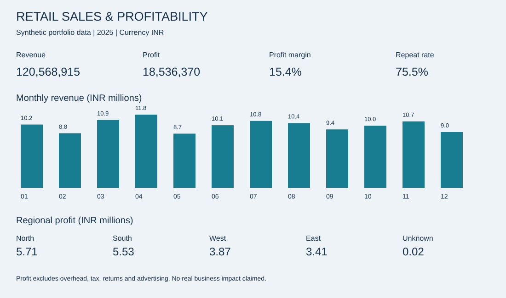

# Retail Sales & Profitability Analysis

**Python · SQL · Excel · Interactive dashboard · Power BI source kit**

An AI-assisted educational portfolio project for Dhananjay, using **6,000 synthetic retail orders** from calendar year 2025. All amounts are INR. No real business results or employer experience are claimed.

## Five business problems

| Problem | Analysis | Decision supported |
|---|---|---|
| Are sales growing? | Monthly revenue, profit and month-over-month growth | Review peak periods and declines |
| Which products lose money? | Product profit, weighted margin and loss orders | Investigate pricing and costs |
| How do discounts relate to margin? | Revenue and profit by discount band | Design a controlled discount test |
| Do customers return? | Repeat customer rate and customer segments | Design a second-purchase campaign |
| Which regions need attention? | Revenue, profit, margin, AOV and ranking | Compare volume and unit economics |

## View or download

| What you want | Open this | Status |
|---|---|---|
| Excel dashboard | [Download workbook](https://raw.githubusercontent.com/Dhananjay1718/retail-sales-profitability-analysis/main/excel/retail_analysis.xlsx) | Built; Dashboard and Mobile Summary tabs |
| Interactive browser charts | [Download HTML](https://raw.githubusercontent.com/Dhananjay1718/retail-sales-profitability-analysis/main/dashboard/dashboard.html) | Built; open the downloaded file in a browser |
| All files | [Download ZIP](https://raw.githubusercontent.com/Dhananjay1718/retail-sales-profitability-analysis/main/dist/retail-analytics.zip) | Built; extract before opening files |
| Native Power BI report | [Setup guide](powerbi/README.md) | Not built; DAX and data supplied |

The image below is a static Python-generated preview. GitHub displays HTML source,
not the running dashboard. On a phone, the workbook's Mobile Summary tab is the
most compact view. Previously downloaded files do not update: download again.

## Open the project

- [Executive summary](reports/executive_summary.md) — computed findings and recommendations.
- [Excel workbook](excel/retail_analysis.xlsx) — formulas, source table, summaries and charts.
- [Dashboard preview](reports/dashboard_preview.svg) — visible in GitHub.
- [Interactive dashboard](dashboard/dashboard.html) — download and open in a browser.
- [SQL database and queries](sql/) — SQLite; no server required.
- [Python notebook](python/analysis.ipynb) and [reproducible pipeline](python/build_project.py).
- [Power BI instructions](powerbi/README.md) and [DAX measures](powerbi/measures.dax).
- [Interview preparation](docs/interview_preparation.md).
- [Complete downloadable ZIP](dist/retail-analytics.zip).

Generated files appear after the **Build project** workflow succeeds. The validation
report records checks actually executed. A native Power BI PBIX is **not supplied**.

## Reproduce

Use Python 3.11 or newer from the repository root:

```bash
python -m pip install -r requirements.txt
python python/build_project.py
```

The script rebuilds generated data, reports, workbook, notebook, SQLite database,
dashboard and ZIP. Source SQL and READMEs remain editable. GitHub Actions runs the
same script and commits generated deliverables after successful validation.

## Data and validation

The generator uses seed 42. Raw data has 6,030 rows, including 30 exact duplicates,
20 inconsistently formatted regions and 10 missing regions. Cleaning retains
6,000 orders and labels missing regions Unknown.

Checks cover order keys, required fields, value ranges, foreign keys, SQL/Pandas
reconciliation for all five questions, and Excel cached formula results.
See [data dictionary](data/README.md) and [validation report](reports/validation.json).

## Important definitions

Revenue = quantity × unit price × (1 − discount).
Profit = revenue − quantity × unit cost − shipping cost.
Margin = total profit / total revenue.
Repeat customer rate = customers with at least two orders / observed customers.

## Limitations

Synthetic data is for learning; patterns cannot support real market conclusions.
One product per order; no returns, cancellations, taxes, ad spend or fixed overhead.
Repeat purchase frequency is not cohort retention. Discount comparisons are
descriptive and confounded by product mix. Recommendations have not been tested.


