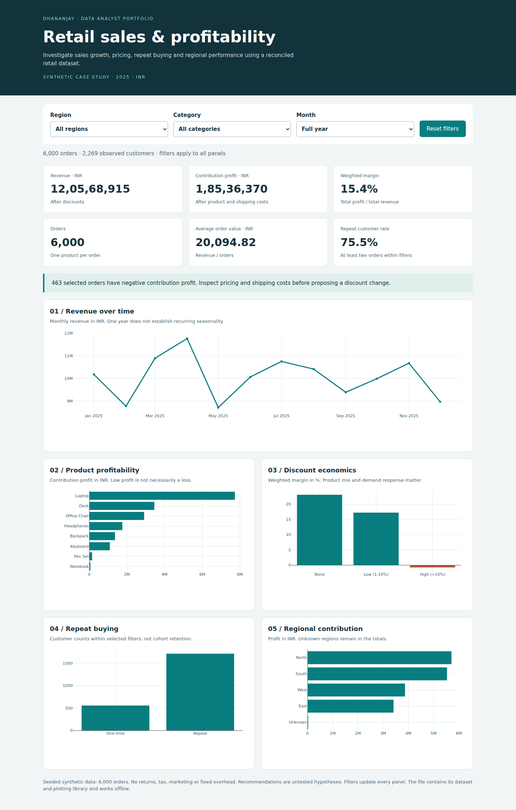

# Retail Sales & Profitability Analysis

**Python · SQLite · Excel · Interactive analytics**

[](https://github.com/Dhananjay1718/retail-sales-profitability-analysis/actions/workflows/build.yml)

A reproducible, AI-assisted portfolio case study by **Dhananjay**. Investigate
profitability and repeat purchasing across **6,000 synthetic orders** in 2025.
Currency: INR.

[Download project ZIP](https://raw.githubusercontent.com/Dhananjay1718/retail-sales-profitability-analysis/main/dist/retail-analytics.zip)
· [Excel workbook](https://raw.githubusercontent.com/Dhananjay1718/retail-sales-profitability-analysis/main/excel/retail_analysis.xlsx)
· [Interactive dashboard](https://raw.githubusercontent.com/Dhananjay1718/retail-sales-profitability-analysis/main/dashboard/dashboard.html)
· [Business case](reports/business_case.md)
· [Executed notebook](python/analysis.ipynb)



## The business question

Where should a retail team investigate first: sales volume, pricing, customer
repeat purchase, or regions? The project separates observations from hypotheses
about what might improve them.

| Question | Approach | Evidence |
|---|---|---|
| Are sales growing? | Monthly aggregation and LAG | [SQL 01](sql/01_monthly_growth.sql) |
| Which transactions lose money? | Product profit and loss orders | [SQL 02](sql/02_product_profitability.sql), [SQL 06](sql/06_loss_making_products.sql) |
| How do discounts relate to margin? | Weighted margin and within-product comparisons | [SQL 03](sql/03_discount_impact.sql), [SQL 07](sql/07_product_discount_detail.sql) |
| Do customers purchase again? | Frequency and eligible 90-day follow-up | [SQL 04](sql/04_customer_segments.sql), [SQL 08](sql/08_repeat_within_90_days.sql) |
| Which regions need attention? | Profit ranking, AOV and margin | [SQL 05](sql/05_regional_performance.sql) |

## Findings worth discussing

- The high-discount band has **−0.72% contribution margin** in this synthetic
  dataset. The next step is product-level diagnosis and a controlled experiment,
  not a claim that removing discounts will increase profit.
- Every product has positive total profit, but individual orders can lose money.
  Aggregate profitability can hide transaction-level problems.
- Full-year repeat customer rate is **75.54%**. The separate 90-day analysis
  excludes customers without a complete observation window.

The [business case](reports/business_case.md) contains computed sample sizes,
evidence, proposed action and limitations. The [executive summary](reports/executive_summary.md)
answers the original five questions.

## Deliverables

| Component | Included |
|---|---|
| Data | Seeded raw/clean CSVs, explicit grain and quality report |
| SQL | Constrained SQLite database and eight queries |
| Python | Reproducible pipeline, independent reconciliation, executed notebook |
| Excel | Five charts, six formula KPIs, Mobile Summary and source tables |
| Browser dashboard | Shared filters, reset and empty-state handling |
| Quality checks | Browser interactions, phone-width checks, screenshots and link checks |
| Power BI | DAX, calendar and instructions; **native PBIX not built** |

GitHub shows HTML source rather than running the dashboard. Download the HTML
and open it in a browser; it works offline. Extract the ZIP before opening files.
For Excel on a phone, choose **Mobile Summary**. Download a fresh copy after updates.

## Reproduce

Use Python 3.11 or newer:

```bash
python -m pip install -r requirements.txt
python python/build_project.py
```

Optional browser checks and screenshots:

```bash
python -m pip install -r requirements-browser.txt
python -m playwright install chromium
python python/check_dashboard.py
```

GitHub Actions runs both stages before replacing generated deliverables.
Inspect the [validation report](reports/validation.json),
[browser results](reports/browser_validation.json) and [file hashes](reports/manifest.json).

## Definitions and learning guides

Revenue = units × price × (1 − discount).
Contribution profit = revenue − product costs − shipping.
Weighted margin = total profit / total revenue.
Dashboard repeat rate counts >=2 orders within selected filters.
The 90-day metric requires full follow-up and a later-date purchase.

[Data dictionary](data/README.md) · [SQL](sql/README.md) ·
[Python](python/README.md) · [Excel](excel/README.md) ·
[Power BI status](powerbi/README.md) · [Interview preparation](docs/interview_preparation.md)

## Scope and attribution

Educational synthetic data, developed with AI assistance. This is not client work
and makes no real-business uplift claim. One product per order; no returns, taxes,
marketing or fixed overhead. The generator does not model real demand.
Product-mix comparisons do not establish causality.

A native Power BI report and desktop Excel visual signoff remain outstanding.
Useful interview topics include grain, denominators, observation windows,
reconciliation and the next experiment.
